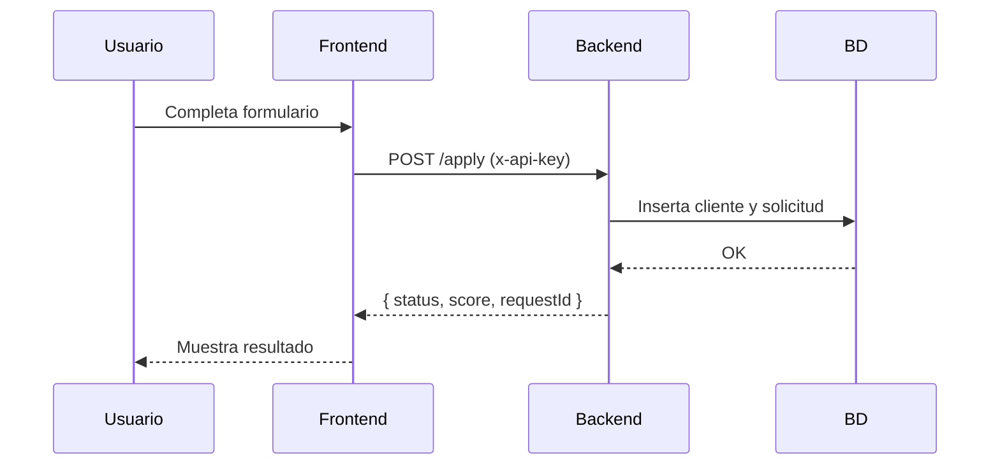

# Credit App — Simulador de Solicitudes de Crédito

## 📌 Descripción general
Este proyecto implementa una aplicación web que simula el flujo de **solicitud de crédito**.  
El sistema permite:

- Capturar datos de un cliente y su solicitud.
- Evaluar automáticamente si la solicitud es **APROBADA o RECHAZADA** mediante un **scoring simple**.
- Persistir clientes y solicitudes en una base de datos.
- Consultar **indicadores estadísticos** (aprobados vs rechazados).
- Simular varias solicitudes automáticamente para pruebas y análisis.

### 🛠️ Stack utilizado
- **Frontend:** React + Vite (con Recharts para gráficos).
- **Backend:** ASP.NET Core Web API + Entity Framework Core.
- **Base de datos:** SQLite (por defecto), script SQL Server incluido para entrega.
- **Seguridad:** API Key sencilla (`x-api-key: 123`) + CORS.
- **Contenedores:** Docker (frontend, backend, BD opcional).
- **Pruebas:** 
  - Backend → xUnit.  
  - Frontend → Vitest + React Testing Library.

---

## ⚙️ Instalación y uso en desarrollo

### 1. Clonar el repo
```bash
git clone https://github.com/iisaacii/credit-app.git
cd credit-app
```

### 2. Backend
```bash
cd backend/CreditApi
dotnet ef database update   # crea SQLite local
dotnet run
```
- Servidor en: **http://localhost:5131**
- Swagger en: **http://localhost:5131/swagger**

### 3. Frontend
```bash
cd ../../frontend
cp .env.example .env        # crea tu .env local
npm install
npm run dev
```
- Aplicación en: **http://localhost:5173**

---

## 🐳 Ejecución con Docker (recomendado)

Desde la raíz del proyecto:
```bash
docker compose up --build
```

- **Frontend:** http://localhost:5173  
- **Backend (Swagger):** http://localhost:5131/swagger  

> Importante: Para probar endpoints en Swagger, presiona **Authorize** e ingresa API Key: `123`.

---

## 🔐 Seguridad
- Todas las peticiones al backend requieren el header:
  ```
  x-api-key: 123
  ```
- El frontend ya envía este header automáticamente.

---

## 📡 Endpoints principales
- `POST /api/credit/apply` → crea solicitud y devuelve `{ status, score, requestId }`
- `GET  /api/credit/stats` → estadísticas `{ approved, rejected, total }`
- `GET  /api/credit/all`   → historial de solicitudes
- `POST /api/credit/simulate?count=50` → genera datos demo

---

## 🧪 Pruebas
### Backend
```bash
cd backend
dotnet test
```

### Frontend
```bash
cd frontend
npm test
```

---

## 🗄️ Base de datos
- Por defecto se usa **SQLite** (archivo `credit.db`, ignorado en Git).
- En `/sql/create_schema.sql` se incluye un script de **SQL Server** con tablas y un **Stored Procedure extra** (`sp_InsertCreditRequest`).

---

## 📊 Matriz de pruebas
| Caso | Ingreso | Antigüedad | Monto  | Esperado   |
|------|---------|------------|--------|------------|
| 1    | 50,000  | 36         | 100,000| APROBADO   |
| 2    | 10,000  | 6          | 20,000 | RECHAZADO  |
| 3    | 20,000  | 18         | 50,000 | APROBADO   |
| 4    | 0       | 0          | 5,000  | RECHAZADO  |

---

## 📦 Estructura del proyecto
```
credit-app/
  backend/
    CreditApi/
      Controllers/
      Data/
      Dtos/
      Middlewares/
      Models/
      Services/
      Program.cs
  frontend/
    src/
    public/
    Dockerfile
    .env.example
  sql/
    create_schema.sql
  docker-compose.yml
  README.md
  .gitignore
```

---

## 📈 Diagramas

### Arquitectura
```mermaid
flowchart LR
    A[React (Vite)] --> X[HTTP JSON] --> B[ASP.NET Core API]
    B --> Y[EF Core] --> C[(SQLite / SQL Server)]
    A <-- Z[CORS + API Key] --> B
```

### Secuencia de solicitud


---

## 🚀 Instrucciones para el evaluador
1. **Con Docker**  
   - `docker compose up --build`  
   - Frontend: http://localhost:5173  
   - Backend: http://localhost:5131/swagger  
   - API Key: `123`

2. **Sin Docker**  
   - Backend: `dotnet ef database update && dotnet run` (puerto 5131)  
   - Frontend: `npm install && npm run dev` (puerto 5173)

3. **Probar flujo completo:**  
   - En el form (frontend) → llenar datos → enviar → ver resultado.  
   - En indicadores → ver aprobados/rechazados.  
   - En Swagger → usar `/simulate` y `/stats`.  
