# Credit App — Simulador de Solicitudes de Crédito

## 📌 Descripción general
Este proyecto implementa una aplicación web que simula el flujo de **solicitud de crédito**.  
El sistema permite:

- Capturar datos de un cliente y su solicitud.
- Evaluar automáticamente si la solicitud es **APROBADA o RECHAZADA** mediante un **scoring simple**.
- Persistir clientes y solicitudes en una base de datos.
- Consultar **indicadores estadísticos** (aprobados vs rechazados).
- Simular varias solicitudes automáticamente para pruebas y análisis.
- **Nuevo:** Predecir aprobaciones con un **modelo de Machine Learning** entrenado con registros históricos.

### 🛠️ Stack utilizado
- **Frontend:** React + Vite (con Recharts para gráficos).
- **Backend:** ASP.NET Core Web API + Entity Framework Core.
- **Base de datos:**  
  - **SQLite** (por defecto, rápida para pruebas locales).  
  - **SQL Server** (soportado en Docker, incluye script `create_schema.sql` con tablas + Stored Procedure).
<<<<<<< HEAD
=======
- **Microservicio ML:** FastAPI + scikit-learn (modelo RandomForestClassifier).  
>>>>>>> 21c9bfc (Agregar microservicio ML con FastAPI y modelo de clasificación para predicción de créditos)
- **Seguridad:** API Key sencilla (`x-api-key: 123`) + CORS.
- **Contenedores:** Docker (frontend, backend, BD y servicio ML).
- **Pruebas:** 
  - Backend → xUnit.  
  - Frontend → Vitest + React Testing Library.

---

## ⚙️ Instalación y uso en desarrollo

### 1. Clonar el repo
```bash
git clone https://github.com/iisaacii/credit-app.git
cd credit-app
```

### 2. Backend (modo SQLite por defecto)
```bash
cd backend/CreditApi
dotnet ef database update   # crea SQLite local (credit.db)
dotnet run
```
- Servidor en: **http://localhost:5131**
- Swagger en: **http://localhost:5131/swagger**

### 3. Frontend
```bash
cd ../../frontend
cp .env.example .env        # crea tu .env local
npm install
npm run dev
```
- Aplicación en: **http://localhost:5173**

---

## 🐳 Ejecución con Docker (recomendado)

### 1. Levantar todos los servicios
Desde la raíz del proyecto:
```bash
docker compose up --build
```

Esto levanta:
- **Frontend:** http://localhost:5173  
- **Backend (Swagger):** http://localhost:5131/swagger  
<<<<<<< HEAD
- **Base de datos:** SQL Server 2022 (usuario: `sa`, contraseña: `Your_password123!`)
=======
- **Base de datos:** SQL Server 2022 (usuario: `sa`, contraseña: `Your_password123!`)  
- **ML Service:** http://localhost:8000/docs
>>>>>>> 21c9bfc (Agregar microservicio ML con FastAPI y modelo de clasificación para predicción de créditos)

### 2. Inicializar la base de datos
El script `sql/create_schema.sql` crea:
- Tablas (`Clients`, `Branches`, `CreditRequests`)
- Datos iniciales de sucursales
- Stored Procedure: `sp_InsertCreditRequest`

<<<<<<< HEAD
Para ejecutarlo dentro del contenedor:
=======
Ejecutarlo dentro del contenedor:
>>>>>>> 21c9bfc (Agregar microservicio ML con FastAPI y modelo de clasificación para predicción de créditos)

```bash
docker exec -it credit-sql /opt/mssql-tools18/bin/sqlcmd -S localhost -U sa -P "Your_password123!" -C -i "/docker-entrypoint-initdb.d/create_schema.sql"
```

### 3. Verificar conexión
```bash
docker exec -it credit-sql /opt/mssql-tools18/bin/sqlcmd -S localhost -U sa -P "Your_password123!" -C -d CreditDB -Q "SELECT COUNT(*) FROM dbo.Branches;"
```
Debería devolver **3**.
<<<<<<< HEAD
=======

---

## 🤖 Microservicio ML (FastAPI)
El microservicio entrena un **modelo RandomForestClassifier** con los registros históricos de `CreditRequests`.  
Expone un endpoint:

- **POST /predict**  
  Entrada:
  ```json
  {
    "income": 25000,
    "employment_months": 24,
    "amount": 50000,
    "term_months": 12
  }
  ```
  Respuesta:
  ```json
  {
    "prediction": "APROBADO",
    "probabilities": {
      "RECHAZADO": 0.15,
      "APROBADO": 0.85
    }
  }
  ```

Documentación interactiva: [http://localhost:8000/docs](http://localhost:8000/docs)
>>>>>>> 21c9bfc (Agregar microservicio ML con FastAPI y modelo de clasificación para predicción de créditos)

---

## 🔐 Seguridad
- Todas las peticiones al backend requieren el header:
  ```
  x-api-key: 123
  ```
- El frontend ya envía este header automáticamente.

---

## 📡 Endpoints principales (Backend C#)
- `POST /api/credit/apply` → crea solicitud y devuelve `{ status, score, requestId }`
- `GET  /api/credit/stats` → estadísticas `{ approved, rejected, total }`
- `GET  /api/credit/all`   → historial de solicitudes
- `POST /api/credit/simulate?count=50` → genera datos demo

---

## 🧪 Pruebas
### Backend
```bash
cd backend
dotnet test
```

### Frontend
```bash
cd frontend
npm test
```

---

## 🗄️ Base de datos
- **SQLite**: se usa por defecto (`credit.db`).  
- **SQL Server**: 
  - Servicio en Docker (`credit-sql`, puerto 1433).  
  - Usuario: `sa`  
  - Contraseña: `Your_password123!`  
  - Script inicial: `sql/create_schema.sql` (incluye tablas + `sp_InsertCreditRequest`).  
<<<<<<< HEAD
=======
- **Datos de entrenamiento ML**: Se pueden generar con un script que inserta 5000 registros lógicos de prueba en `CreditRequests`.
>>>>>>> 21c9bfc (Agregar microservicio ML con FastAPI y modelo de clasificación para predicción de créditos)

---

## 📊 Matriz de pruebas
| Caso | Ingreso | Antigüedad | Monto  | Esperado   |
|------|---------|------------|--------|------------|
| 1    | 50,000  | 36         | 100,000| APROBADO   |
| 2    | 10,000  | 6          | 20,000 | RECHAZADO  |
| 3    | 20,000  | 18         | 50,000 | APROBADO   |
| 4    | 0       | 0          | 5,000  | RECHAZADO  |

---

## 📦 Estructura del proyecto
```
credit-app/
  backend/
    CreditApi/
      Controllers/
      Data/
      Dtos/
      Middlewares/
      Models/
      Services/
      Program.cs
  frontend/
    src/
    public/
    Dockerfile
    .env.example
  ml-service/
    ml_service.py
    requirements.txt
    Dockerfile
  sql/
    create_schema.sql
  docker-compose.yml
  README.md
  .gitignore
```

---

## 📈 Diagramas

### Arquitectura
```mermaid
flowchart LR
    A[React (Vite)] --> X[HTTP JSON] --> B[ASP.NET Core API]
    B --> Y[EF Core] --> C[(SQLite / SQL Server)]
    A <-- Z[CORS + API Key] --> B
    B --> M[FastAPI ML Service]
```

### Secuencia de solicitud

```mermaid
sequenceDiagram
    participant U as Usuario
    participant FE as Frontend
    participant API as Backend
    participant DB as BD
    participant ML as ML Service

    U->>FE: Completa formulario
    FE->>API: POST /apply (x-api-key)
    API->>DB: Inserta cliente y solicitud
    DB-->>API: OK
    API-->>FE: { status, score, requestId }
    FE-->>U: Muestra resultado
    FE->>ML: POST /predict (datos crédito)
    ML-->>FE: { prediction, probabilities }
    FE-->>U: Muestra predicción IA
```


---

## 🚀 Instrucciones rápidas 
1. **Con Docker**  
   - `docker compose up --build`  
   - Ejecutar `create_schema.sql` con `sqlcmd`  
   - Frontend: http://localhost:5173  
   - Backend: http://localhost:5131/swagger  
   - ML Service: http://localhost:8000/docs  
   - API Key: `123`

2. **Sin Docker (SQLite)**  
   - Backend: `dotnet ef database update && dotnet run` (puerto 5131)  
   - Frontend: `npm install && npm run dev` (puerto 5173)

3. **Probar flujo completo:**  
   - En el form (frontend) → llenar datos → enviar → ver resultado.  
   - En indicadores → ver aprobados/rechazados.  
   - En Swagger → usar `/simulate` y `/stats`.  
   - En FastAPI → probar `/predict` con un JSON de ejemplo.
